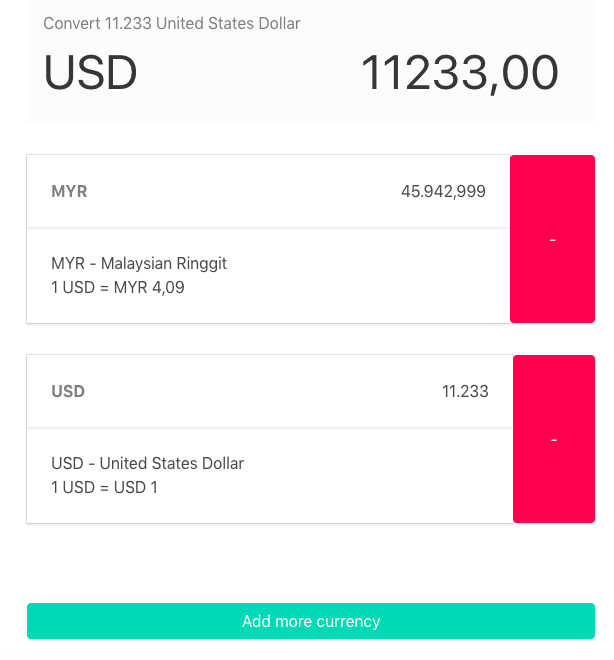

# React Exchange Rates Application

Simple Foreign Exchange Currency App implementation with https://exchangeratesapi.io/



## Features
* Convert currency rate
* Add more currency into list
* App data persist on different tab
  
## Getting Started

* Clone This Project
  ```
  git clone git@github.com:riskteria/exchange-rates.git
  ```

* Install dependencies by running `yarn install`

* Open project directory in terminal
  ```
  cd exchange-rates
  ```

* Build docker image
  ```
  docker image build -t exchange-rates .
  ```

* RUN project in docker
  ```
  docker container run -it -d -p 5000:5000 exchange-rates:latest
  ```

* Open http://localhost:5000 in your browser

## Running Test
* Run Unit test
  ```
  yarn test
  ```
* Run E2E Test
  ```
  yarn e2e
  ```
